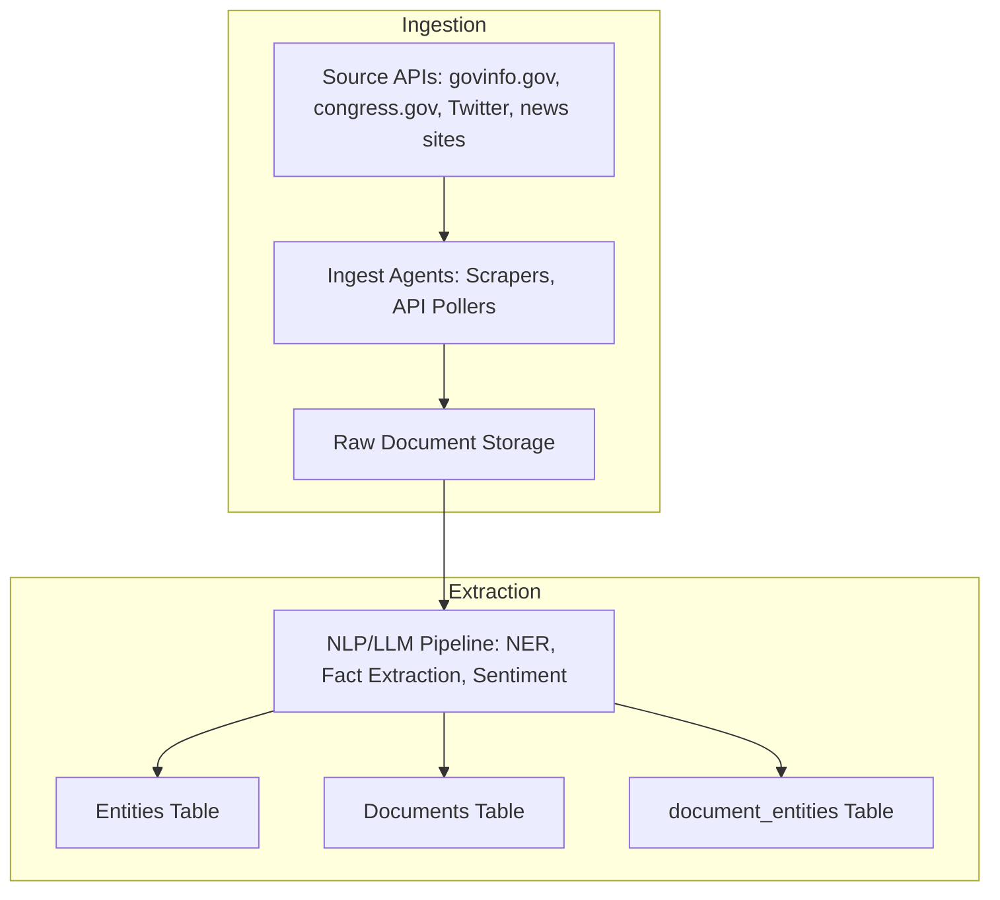
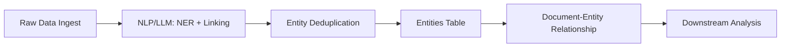

Here’s a comprehensive set of workflows and actionable instructions for ingesting, processing, and analyzing legal documents and metadata from **govinfo.gov** and **congress.gov**—structured so you can pass them directly to Codex/GitHub Copilot (or a junior dev/agent) to scaffold and generate Python scripts, SQL migration files, and analysis routines. This also covers entity extraction, entity ingestion, vector DB, and suggested legal document analytics. **All instructions are ready for use in a pull request or as a project asset.**

---

## **I. Workflow: Ingesting Documents from govinfo.gov and congress.gov**

### **1. govinfo.gov**

#### **a. Discovering and Downloading Data**

* Use [govinfo.gov/bulkdata](https://www.govinfo.gov/bulkdata) to identify available datasets (e.g., Bills, Statutes, Congressional Record, etc.) and their structure (often in ZIP/XML/JSON).
* Use the [govinfo.gov API](https://www.govinfo.gov/developers/api) to:

  * List available collections and new items (bills, hearings, reports, etc.)
  * Query endpoints for “most recent,” by date, or by collection.
  * Retrieve metadata and direct download URLs for documents.

#### **b. Ingestion Steps**

* For each collection or API endpoint:

  1. **Fetch the metadata** (JSON, XML) for each document.
  2. **Download the primary document** (PDF, HTML, XML, TXT, etc.) and any supplementary files.
  3. **Extract and standardize metadata** fields (title, date, doc type, congress/session, etc.).
  4. **Insert document metadata and raw content** into your `documents` SQL table (with unique identifiers, source attribution, document type, etc.).
  5. **Trigger further processing** (entity extraction, NLP, vectorization, etc.) after raw ingestion.

### **2. congress.gov**

#### **a. Discovering and Downloading Data**

* Use [congress.gov API documentation](https://www.congress.gov/help/developers/api-overview) and endpoints:

  * Search for bills, amendments, people, roll call votes, etc.
  * API returns JSON with URLs to full documents, summaries, sponsor info, etc.

#### **b. Ingestion Steps**

* For each resource (bills, amendments, etc.):

  1. **Query the API** for new or updated items.
  2. **Download summary, full text, sponsor info, etc.** for each item.
  3. **Normalize and store metadata** in `documents` table.
  4. **Extract/collect related entities** (sponsors, cosponsors, committees, agencies, topics).
  5. **Insert entities** into `entities` table and create relationships (foreign keys).

---

## **II. Entity Extraction and Ingestion Workflow**

### **Trigger Conditions**

* Trigger entity extraction:

  * When a new document is ingested and processed.
  * When a name or entity in a document does **not** match an existing `entities` table record (i.e., no foreign key match).

### **Entity Extraction Steps**

1. **Run Named Entity Recognition (NER)** using spaCy, NLTK, or an LLM to extract:

   * **People:** Legislators, officials, legal authors, witnesses
   * **Organizations:** Agencies, committees, corporations, NGOs
   * **Legislation:** Bill names/numbers, statute references
   * **Locations:** Countries, states, districts
   * **Topics/Keywords:** Major themes, policy areas

2. **Deduplicate and Standardize Entities:**

   * Normalize names (e.g., “Rep. John Smith” vs. “John Smith”)
   * Check for existing entries in `entities` table; if not present, insert as new.

3. **Update Relationships:**

   * For each document, maintain join/relationship tables to track which entities appear in which documents (e.g., `document_entity_map`).

---

## **III. SQL & Vector DB Ingestion Workflow**

1. **SQL Ingestion:**

   * Insert each document’s **metadata and raw content** into a `documents` table.
   * Insert **entities** into an `entities` table, with type, name, source, and other metadata.
   * Maintain **join tables** (e.g., `document_entity_map`, `entity_relationships`).

2. **Vector DB Ingestion:**

   * For each document:

     1. Run document text through an **embedding model** (OpenAI, BGE, SentenceTransformers, Llama.cpp, etc.).
     2. Store the resulting embedding vectors in your vector DB (e.g., **Chroma**, **Weaviate**, **Qdrant**, **Milvus**, **PGVector**).
     3. Attach **metadata** and unique IDs to each vector chunk.

---

## **IV. Workflow for Analyzing Legal Documents / Bills (Legal NLP Analysis)**

### **A. Analysis Steps**

1. **Text Extraction & Preprocessing:**

   * Convert all documents to plain text (from PDF, XML, HTML as needed).
   * Clean and normalize text.

2. **Section and Clause Identification:**

   * Segment documents by section, clause, amendment, etc.

3. **Entity Extraction (NER):**

   * Extract named people, organizations, locations, references to other laws/statutes.

4. **Bill Summarization:**

   * Generate a **bullet-point summary** and a 1–2 sentence abstract using LLM summarization.

5. **Intent and Impact Assessment:**

   * Extract the **stated purpose/intent** of the bill (e.g., “to amend the Social Security Act…”).
   * Identify the **scope** and **key changes** (e.g., affected sections, new agencies created).

6. **Action Extraction:**

   * Identify main **actions** mandated (e.g., “requires the Secretary of X to…”).
   * Flag any **funding changes**, mandates, or restrictions.

7. **Sentiment & Bias Analysis:**

   * Assess the tone and sentiment (neutral, positive, negative, adversarial).
   * Detect partisan language or potential bias using an ensemble of models.

8. **Legal Reference Linking:**

   * Extract references to other statutes, regulations, and link them (e.g., US Code sections).

9. **Topic Modeling & Thematic Grouping:**

   * Use topic modeling (LDA, BERTopic, etc.) or LLM embeddings to bin/group documents by topic/theme.

10. **Fact-Checking & Consistency:**

    * Identify key factual assertions and cross-check against trusted sources.

### **B. Models and Libraries to Use**

* **spaCy** (legal models), **Stanza**, **Blackstone** for NER and legal-specific NLP.
* **OpenAI GPT-4**, **Mistral**, **Llama-3**, or **Claude** for summarization, intent extraction, and section breakdown.
* **SentenceTransformers** / **BGE** for vectorization.
* **LDA**, **BERTopic** for topic modeling.
* **LLM-based fact-checking** (Ensemble approach for transparency).
* **Custom prompt chains** for extracting bullet points, purpose, impact, and summarizing amendments.

---

## **V. Sample Codex Instructions for Script Generation**

> **Instructions for Codex/LLM agent:**

1. Scaffold a Python module that:

   * Ingests legal documents from govinfo.gov and congress.gov via both their REST APIs and bulkdata endpoints.
   * Downloads and parses all available metadata and document files.
   * Inserts document metadata, content, and normalized entities into SQL tables (`documents`, `entities`, `document_entity_map`).
   * Vectorizes text using SentenceTransformers or OpenAI embeddings, and inserts chunks into a vector database.
   * Runs NER and LLM-based routines to extract people, organizations, and bill references; updates `entities` table and links to documents.
   * Runs summary, intent extraction, and section segmentation via LLM or prompt chain.
   * Outputs logs, error handling, and progress reporting.

2. Create a **scheduler/cron-compatible script** to:

   * Check for and ingest new documents daily.
   * Trigger entity extraction and downstream analysis.

3. Write modular code so that the document ingestion, entity extraction, vectorization, and analysis components can be run independently or as part of a pipeline.

4. Prepare an example SQL schema for `documents`, `entities`, `document_entity_map`, and vector index tables.

5. Include sample configs for API keys and database connections.

---

## **VI. Example Analysis Outputs and Metrics**

* Summaries and intent statements for each bill.
* Entity relationship graph (who’s involved with what bill).
* Actionable dataset: list of mandates, funding changes, regulatory actions per bill.
* Grouped topic bins (e.g., “Health Policy”, “Defense”, “Technology”).
* Sentiment/bias scoring and flagging.
* Bill cross-references and dependency mapping.
* Timeline of legislative activity by entity.

---

## **References and Example Projects**

* [govinfo API Docs](https://www.govinfo.gov/developers/api)
* [govinfo Bulkdata Docs](https://www.govinfo.gov/bulkdata)
* [congress.gov API Docs](https://www.congress.gov/help/developers/api-overview)
* [Legal NLP with spaCy Blackstone](https://github.com/ICLRandD/Blackstone)
* [LDA and BERTopic Topic Modeling](https://maartengr.github.io/BERTopic/index.html)

---

## **Quick Checklist for Codex:**

* [ ] Scripts fetch and parse documents and metadata from govinfo.gov and congress.gov APIs/bulkdata.
* [ ] All raw documents, metadata, and extracted entities inserted into normalized SQL tables.
* [ ] Entities deduplicated, mapped, and related to documents.
* [ ] Documents vectorized and inserted into a vector DB.
* [ ] NLP and LLMs extract and summarize meaning, intent, key actions.
* [ ] Topic modeling and binning enabled for research/benchmarking.
* [ ] All code modular, documented, and ready for scheduled/triggered use.

---

**Let me know if you want this split into README-ready files or if you want starter code generated for any module.**


Absolutely! Here’s a full breakdown covering **SQL and vector DB table definitions**, **workflow diagrams**, and new SRS features—**all mapped to your project’s goals** (fact-checking, entity extraction, social media analysis, document analysis, etc.).

---

## 1. **SQL & Vector Database Table Definitions**

### **A. SQL Database (Relational) – Core Tables**

#### **1. `documents`**

* `id` (PK)
* `source_url`
* `title`
* `content`
* `document_type` (bill, law, transcript, tweet, etc.)
* `jurisdiction` (national, state, county, etc.)
* `date_published`
* `date_ingested`
* `ingested_by` (agent/system)
* `metadata` (JSONB for flexible extra info)

#### **2. `entities`**

* `id` (PK)
* `name`
* `entity_type` (person, organization, committee, outlet, etc.)
* `canonical_id` (for deduplication)
* `description`
* `aliases` (JSONB array)
* `created_at`
* `last_seen_in_doc`

#### **3. `document_entities`**

*(Many-to-many: which entities appear in which docs)*

* `id` (PK)
* `document_id` (FK)
* `entity_id` (FK)
* `extracted_by` (which agent/model)
* `role` (author, subject, mentioned, quoted, etc.)
* `context` (short excerpt/context window)

#### **4. `facts`**

* `id` (PK)
* `fact_text`
* `document_id` (FK, nullable—could be from tweet or doc)
* `entity_id` (FK, nullable—if attributed to someone)
* `source_type` (document, tweet, post, etc.)
* `fact_date`
* `fact_confidence` (score)
* `fact_type` (statement, claim, number, etc.)
* `status` (pending, verified, debunked, etc.)
* `checked_by` (agent/model)
* `checked_at`
* `factcheck_notes`

#### **5. `fact_checks`**

* `id` (PK)
* `fact_id` (FK)
* `result` (true/false/partially true/misleading, etc.)
* `checked_by` (agent or human)
* `check_date`
* `evidence` (JSONB or text)
* `confidence_score`
* `review_notes`

#### **6. `social_media_posts`**

* `id` (PK)
* `platform`
* `post_id`
* `author_id` (FK to entities)
* `content`
* `date_posted`
* `metadata` (JSONB)

#### **7. `outlets`, `journalists`, `committees`, etc.**

*(Optional, for richer normalization; can use entity subtypes)*

---

### **B. Vector Database (Semantic Search, RAG, Similarity)**

**If using Weaviate or pgvector in PostgreSQL:**

#### **1. `document_vectors`**

* `id` (PK)
* `document_id` (FK to SQL)
* `embedding` (vector array/pgvector/Weaviate vector)
* `chunk_index` (if splitting docs)
* `text_chunk`
* `metadata` (JSONB: section, type, etc.)

#### **2. `entity_vectors`**

* `id` (PK)
* `entity_id` (FK)
* `embedding`
* `metadata`

#### **3. `fact_vectors`**

* `id` (PK)
* `fact_id` (FK)
* `embedding`
* `metadata`

*Note: In Weaviate, each “object” (doc, entity, fact) gets a class and can store vectors + properties. With pgvector, you add a `vector` column to normal SQL tables.*

---

## 2. **Workflow Diagrams**

### **A. Document/Data Ingestion & Entity Extraction**



---

### **B. Fact-Checking Social Media & Public Statements**

```mermaid
flowchart TD
    A[Social Media API (X, Twitter, etc.)]
    B[Ingest Social Posts]
    C[Entity Matching: Resolve author to entity table]
    D[Claim/Fact Extraction (LLM)]
    E[Fact-Checking Agent]
    F[Fact Table]
    G[Fact_Checks Table]

    A --> B --> C --> D --> E --> G
    D --> F
    G --> F
```

---

### **C. Document Analysis Workflow**

```mermaid
flowchart TD
    A[Document (bill, law, transcript)]
    B[Chunking/Section Split]
    C[NER + Entity Linking]
    D[Fact/Claim Extraction]
    E[Vectorization/Embedding]
    F[Store in Vector DB]
    G[Store in SQL DB]

    A --> B --> C --> D --> E --> F
    B --> G
    C --> G
    D --> G
```

---

## 3. **SRS Update: Add Social Media Fact-Checking Feature**

### **Section: Functional Requirements**

**Fact-Checking Public Statements (Social Media & News)**

* **Description**: The system shall monitor statements made by tracked entities (e.g., politicians, journalists) on social media (especially Twitter/X) and news outlets, automatically extract factual claims, and perform fact-checking against known data, other statements, and trusted sources.
* **Criteria**:

  * Entities are matched to posts/tweets using entity table.
  * Claims are extracted from new posts and stored as facts.
  * Each fact is run through automated fact-checking agents (LLM, heuristics, RAG).
  * Results are stored in `fact_checks` and linked to the original fact/post/entity.
  * Discrepancies and “likely misinformation” are flagged in the UI.
  * Fact-check audit trails (evidence, rationale) are available for review.
* **Microgoal**: Automate daily scan of new posts for all high-priority entities and trigger fact-checking workflow with result stored in DB.

---

## 4. **Entity Extraction: API, Sources, and Methodology Workflow**

### **A. Sources**

* **APIs**: `govinfo.gov/api`, `congress.gov`, Twitter/X, news APIs, YouTube (transcripts)
* **Web Scraping**: For less-structured sites

### **B. Methodology**

* **Step 1**: Ingest raw document/post (via API or scraper)
* **Step 2**: Run LLM/NLP pipeline:

  * Named Entity Recognition (NER)
  * Entity Linking (canonical match/merge)
  * Store in `entities`, create if new
* **Step 3**: Map relationships (entity ↔ document, entity ↔ entity, etc.)
* **Step 4**: Trigger downstream workflows: fact-checking, sentiment, bias analysis, etc.

### **C. Diagram**



---

## 5. **Document Analysis Workflow**

### **Tasks Performed:**

* Chunking (section/title/paragraph)
* NER/entity linking
* Fact/claim extraction
* Sentiment/bias detection
* Vectorization (embeddings)
* Storing all the above in DB (SQL and vector)

### **Diagram**

```mermaid
flowchart TD
    A[Document Ingestion]
    B[Section/Paragraph Chunking]
    C[NER/Entity Linking]
    D[Fact Extraction]
    E[Sentiment/Bias Analysis]
    F[Embedding/Vectorization]
    G[DB Storage (SQL + Vector)]
    H[Feedback/Audit Trail]

    A --> B --> C --> D --> E --> F --> G
    G --> H
```

---

## 6. **Summary Table (SQL & Vector DB Core)**

| Table                | Purpose                                                |
| -------------------- | ------------------------------------------------------ |
| `documents`          | Store documents and metadata                           |
| `entities`           | Canonical entity profiles (people, orgs, etc.)         |
| `document_entities`  | Map: which entities appear in which docs               |
| `facts`              | Store factual claims/quotes/statements                 |
| `fact_checks`        | Store results of fact-checking                         |
| `social_media_posts` | Ingested posts for analysis/fact-checking              |
| `document_vectors`   | Vectorized (embedded) doc chunks for RAG/search        |
| `entity_vectors`     | Embeddings for entities, for semantic search/grouping  |
| `fact_vectors`       | Embeddings for facts, for similarity/disinfo detection |

---

## 7. **How to Use These Tables & Workflows**

* Ingest new data → extract entities → map entities to documents/posts → extract claims → fact-check and store results → power RAG and dashboards from both SQL and vector DBs.
* This schema supports *auditable, explainable, and scalable* analytics and reporting.

---

**Next Steps**:

* Implement/validate ERD in your SQL designer.
* Use these diagrams in internal docs (Mermaid, Draw\.io, etc.).
* Plug this schema into your ORM (e.g., Drizzle) and vector DB (Weaviate/pgvector).
* Add the new SRS section to your `SRS.md` and update your documentation for fact-checking and entity extraction as core features.

---

Let me know if you want SQL CREATE TABLE statements, an editable ERD, or ready-to-drop Mermaid/Draw\.io code!
